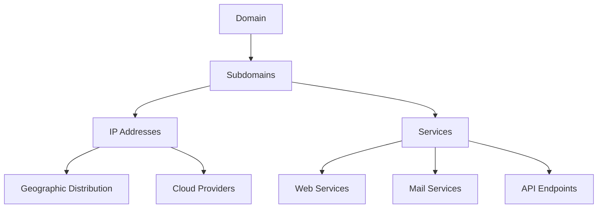

# 🔍 DNS Reconnaissance Report: example.com

## 📋 Table of Contents

1. [Executive Summary](#executive-summary)
2. [Statistics](#statistics)
3. [Security Analysis](#security-analysis)
4. [Data Overview](#data-overview)

## 📈 Executive Summary

This report contains reconnaissance data for **example.com** generated on 2025-07-11.

- **Total Subdomains Discovered**: 6
- **Unique IP Addresses**: 6
- **Countries Detected**: 1
- **Organizations**: 5

## 📊 Statistics

- **Total Records**: 6
- **Unique IP Addresses**: 6
- **Countries**: 1
- **Organizations**: 5
- **ASNs**: 5

### 🌍 Top Countries

- **United States**: 6 (100.0%)

### 🏢 Top Organizations

- **Google LLC**: 2 (33.3%)
- **Edgecast Inc.**: 1 (16.7%)
- **Cloudflare, Inc.**: 1 (16.7%)
- **Amazon.com, Inc.**: 1 (16.7%)
- **Example Corp Internal**: 1 (16.7%)

## 🔒 Security Analysis

**Overall Risk Level**: 🔴 HIGH

### 🔍 Key Findings

- Found 4 potentially sensitive subdomains
- Cloud infrastructure detected: Cloudflare, AWS, Google Cloud

### ⚠️ Potentially Sensitive Subdomains

| Subdomain | IP | Keyword | Risk Level |
|-----------|----|---------| -----------|
| `api.example.com` | `104.16.132.229` | `api` | medium |
| `dev-api.example.com` | `52.84.167.168` | `dev` | medium |
| `admin.example.com` | `192.168.1.10` | `admin` | high |
| `test.example.com` | `35.186.224.25` | `test` | medium |

### ☁️ Cloud Infrastructure

- **Cloudflare**: 1 endpoints
- **AWS**: 1 endpoints
- **Google Cloud**: 2 endpoints

### 💡 Security Recommendations

- Review access controls for sensitive subdomains
- Ensure cloud security best practices are implemented

## 📊 Visual Analysis

### Infrastructure Overview

## 📋 Example Corp Internal

**Records in this section**: 1

| Subdomain | IP | PTR | ASN | Country | Organization | Tags |
|-----------|----|----|-----|---------|--------------|------|
| `admin.example.com` | `192.168.1.10` | `admin-panel.internal.example.com` | `AS64512` | `United States` | `Example Corp Internal` | `ip-private, internal, security-sensit...` |

## 📋 Cloudflare, Inc.

**Records in this section**: 1

| Subdomain | IP | PTR | ASN | Country | Organization | Tags |
|-----------|----|----|-----|---------|--------------|------|
| `api.example.com` | `104.16.132.229` | `104.16.132.229` | `AS13335` | `United States` | `Cloudflare, Inc.` | `ip-public, production, api-endpoint, ...` |

## 📋 Amazon.com, Inc.

**Records in this section**: 1

| Subdomain | IP | PTR | ASN | Country | Organization | Tags |
|-----------|----|----|-----|---------|--------------|------|
| `dev-api.example.com` | `52.84.167.168` | `server-52-84-167-168.lax34.r.cloudfront.net` | `AS16509` | `United States` | `Amazon.com, Inc.` | `api-endpoint, development, environmen...` |

## 📋 Google LLC

**Records in this section**: 2

| Subdomain | IP | PTR | ASN | Country | Organization | Tags |
|-----------|----|----|-----|---------|--------------|------|
| `mail.example.com` | `74.125.224.26` | `mail-oa1-f26.google.com` | `AS15169` | `United States` | `Google LLC` | `mail-service, production, cloud-gcp, ...` |
| `test.example.com` | `35.186.224.25` | `25.224.186.35.bc.googleusercontent.com` | `AS15169` | `United States` | `Google LLC` | `testing, cloud-gcp, development, envi...` |

## 📋 Edgecast Inc.

**Records in this section**: 1

| Subdomain | IP | PTR | ASN | Country | Organization | Tags |
|-----------|----|----|-----|---------|--------------|------|
| `www.example.com` | `93.184.216.34` | `93.184.216.34` | `AS15133` | `United States` | `Edgecast Inc.` | `environment-prod, production, web-ser...` |

---

**⚠️ Disclaimer**: This report is for authorized security testing purposes only.

*Generated by ReconCLI - Advanced Reconnaissance Toolkit*
